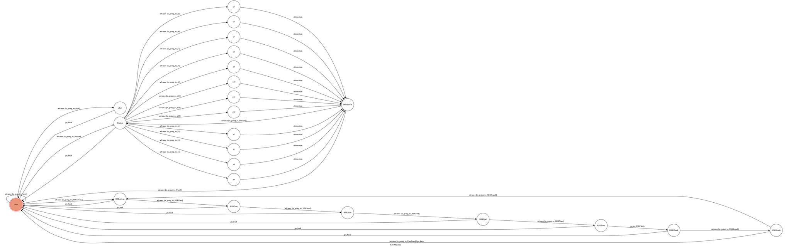

# THSR_bot - TOC Project 2017


A telegram bot based on a finite state machine

THSR_bot -- 高鐵資訊小幫手，讓你輕鬆獲得車站資訊，方便地查詢高鐵時刻。


## Setup


### Prerequisite

* Python 3


#### Install Dependency

```sh

pip install -r requirements.txt

```


* pygraphviz (For visualizing Finite State Machine)

    * [Setup pygraphviz on Ubuntu](http://www.jianshu.com/p/a3da7ecc5303)


### Secret Data


`API_TOKEN` and `WEBHOOK_URL` in app.py **MUST** be set to proper values.

Otherwise, you might not be able to run your code.


### Run Locally

You can either setup https server or using `ngrok` as a proxy.


**`ngrok` would be used in the following instruction**


```sh

ngrok http 5000

```


After that, `ngrok` would generate a https URL.


You should set `WEBHOOK_URL` (in app.py) to `your-https-URL/hook`.


#### Run the sever


```sh

python3 app.py

```


## Finite State Machine




## Usage

The initial state is set to `user`.


* State : **user**

	* Input : `/start`

		* Reply :       
        


	* Input : `/station`

		* Reply : 請輸入要查詢的車站 /1~/12 
        
        * State : **Station**
            * Input: `/1~/12`
                * Reply : 1~12各站的資訊
                
                * State : **/1~/12**
                    * Input : `/1`
                        * Reply: 重新查詢車站
                
                    * Input : `/2`
                        * Reply: 回到首頁(user)
        
	* Input : `/HSRailway`
	    * Reply : 請輸入要查詢的日期

        * State : **HSRailway**
            * Input : 正確的日期格式， ex: `2017/06/05`
                * Reply : 請輸入出發站
                
                * State : **HSRDate**
                    * Input : `/1~/12`
                        * Reply : 請輸入到達站
                        
                    * State : **HSRStart**
                        * Input : `/1~/12`
                            * Reply : 請輸入乘車時間
                            
                            * State : **HSREnd**
                                * Input : 正確的時間格式， ex: `18:00`
                                    * Goto State: **HSRTime**
                                        * Reply : 資料確認
                                        
                                        * State : **HSRCheck**
                                            * Input : `/1`
                                                *  Reply : 高鐵時刻表
                                                
                                                * State : **HSRResult**
                                                    *  Input : `/1`
                                                        * Result : 重新查詢 (**HSRailway**)
                                                    * Input : `/2`
                                                        * Reply : 回到首頁 (**user**)
                                            * Input : `/2`
                                                * Reply : 回到首頁 (**user**)
                                        
                                * Input : 錯誤的時間格式
                                    * Reply : 回到首頁(**user**)
            * Input: 錯誤的日期格式
                * Reply : 回到首頁(**user**)
        
        
    * Input : 任何其他的字串
        * Goto State : **Chat**
            * Reply : 
        
                * 如有有包含  "你好,嗨,哈囉,hi,hello" :
                  ***你好~我是高鐵小幫手年獸 <3 很高興認識你 >////<***

                * 其他 : 
                    6種隨機回答
            
        


## Author

[Lee-W](https://github.com/Lee-W)
[Annie](https://github.com/annie31123)